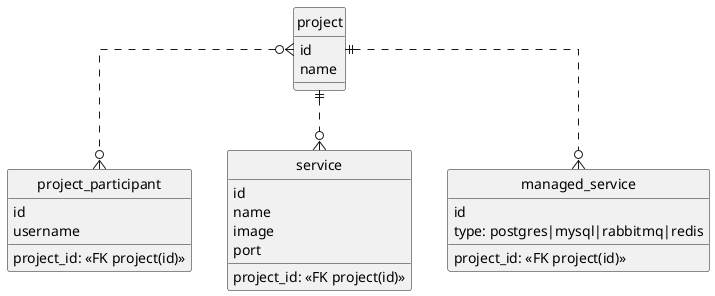

# Database schema

```plantuml
@startuml
' hide the spot
hide circle

' avoid problems with angled crows feet
skinparam linetype ortho

entity project {
  id
  name
}

entity project_participant {
  id 
  project_id: <<FK project(id)>>
  username
}

entity service {
  id
  project_id: <<FK project(id)>>
  name
  image
  port
}

entity managed_service {
  id
  project_id: <<FK project(id)>>
  type: postgres|mysql|rabbitmq|redis
}

project }o..o{ project_participant
project ||..o{ service
project ||..o{ managed_service

@enduml
```
