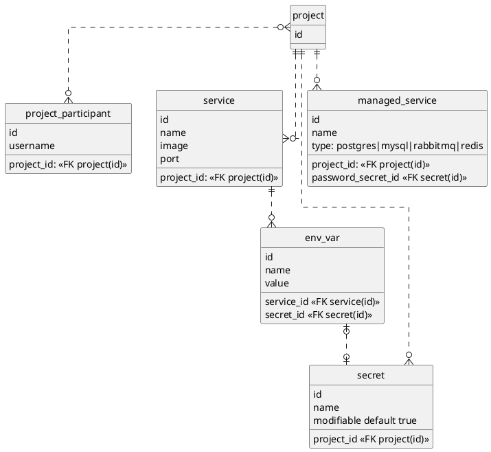

# Database schema

```plantuml
@startuml
' hide the spot
hide circle

' avoid problems with angled crows feet
skinparam linetype ortho

entity project {
  id
}

entity project_participant {
  id 
  project_id: <<FK project(id)>>
  username
}

entity service {
  id
  project_id: <<FK project(id)>>
  name
  image
  port
}

entity managed_service {
  id
  project_id: <<FK project(id)>>
  name
  type: postgres|mysql|rabbitmq|redis
  password_secret_id <<FK secret(id)>>
}

entity env_var {
  id
  service_id <<FK service(id)>>
  name
  value
  secret_id <<FK secret(id)>>
}

entity secret {
  id
  project_id <<FK project(id)>>
  name
  modifiable default true
}

project }o..o{ project_participant
project ||..o{ service
service ||..o{ env_var
env_var |o..o| secret
project ||..o{ managed_service
project ||..o{ secret

@enduml
```
